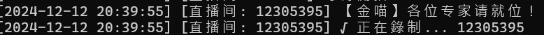
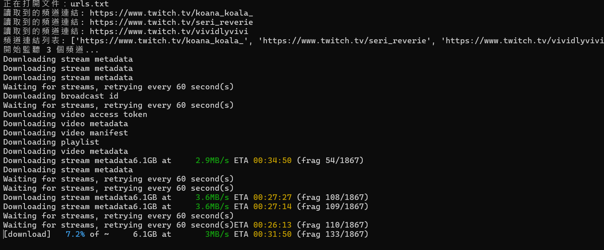
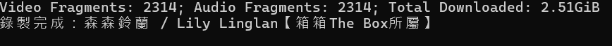
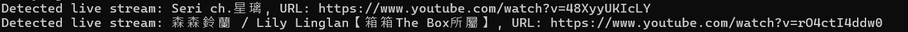
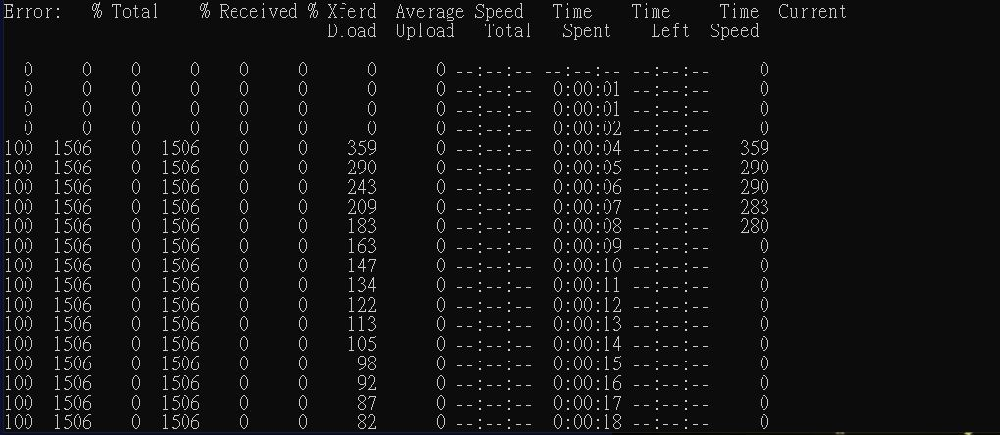
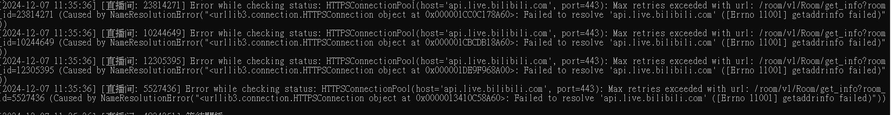

# Live Recorder

**Live Recorder** 是一個多平台直播錄製工具，支持錄製來自 **Bilibili**、**YouTube** 和 **Twitch** 等直播平台的直播視頻。此工具允許用戶輕鬆地捕捉並保存直播內容，適用於想要保存直播記錄或離線觀看的用戶。

## 特點

- **支持多平台**：支援錄製來自 **Bilibili**、**YouTube**、**Twitch** 的直播內容。
- **簡單配置**：提供簡單的配置方式來設置相應的 API 和環境變數。
- **輕鬆錄製**：只需幾條命令行即可開始錄製直播。

## 安裝

1. 配置相應的環境變數和應用程式：
   - 安裝 [FFmpeg](https://ffmpeg.org/)
   - 安裝 [ytarchive](https://github.com/Kethsar/ytarchive)
   - 安裝 [nodejs](https://nodejs.org/) 和 npm
2. 克隆或參考以下相關的 GitHub 庫：
   - [twitch-dlp](https://github.com/DmitryScaletta/twitch-dlp)
   - [Bilibili-API-collect](https://github.com/SocialSisterYi/bilibili-API-collect)
   - [bilibili-live-recorder](https://github.com/zachMelody/bilibili-live-recorder)
   - [ytarchive](https://github.com/Kethsar/ytarchive)

3. 配置並設置 API 憑證和環境變數。

## 使用方法

### 錄製 Bilibili 直播

1. 在命令行中執行：
    ```bash
    python combination.py
    ```

### 錄製 YouTube 直播

1. 在命令行中執行：
    ```bash
    python yt.py
    ```

### 錄製 Twitch 直播

1. 在命令行中執行：
    ```bash
    python TwitchLive_twitchdlp.py
    ```

## 配置檔案

根據不同平台，請設置以下文本檔案：

1. `mid.txt` (Bilibili)：存放 Bilibili up 空間的 MID。
2. `urls.txt` (Twitch)：存放 Twitch 頻道 URL。
3. `channel_id.txt` (YouTube)：存放 YouTube 頻道 ID。

這些配置檔案將告訴程序如何找到相應的直播內容。

## 參考 GitHub 庫及資料

1. [twitch-dlp](https://github.com/DmitryScaletta/twitch-dlp) - 用於錄製 Twitch 直播的工具。
2. [Bilibili-API-collect](https://github.com/SocialSisterYi/bilibili-API-collect) - 收集 Bilibili 直播 API 的工具庫。
3. [bilibili-live-recorder](https://github.com/zachMelody/bilibili-live-recorder) - Bilibili 直播錄製工具。
4. [ytarchive](https://github.com/Kethsar/ytarchive) - 用於錄製 YouTube 直播的工具。
5. [Streamlink](https://yowlab.idv.tw/wordpress/?p=477) - 支援直播流的工具，兼容多平台。

## 執行畫面





## 問題畫面


